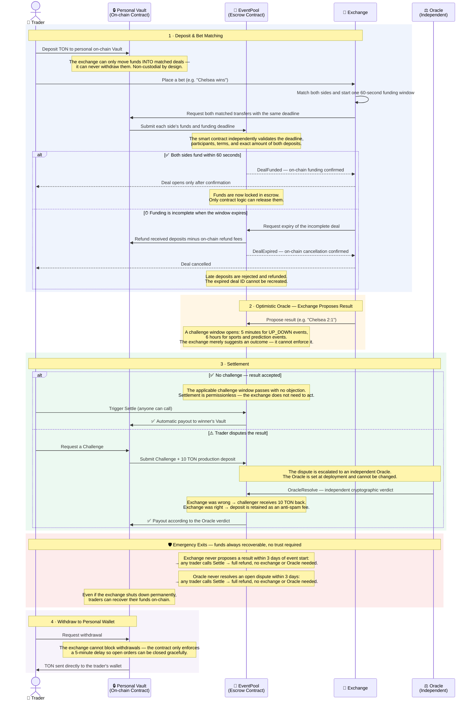

# TONFAIR Smart Contracts & Emergency Refund

This repository contains the source code for the TONFAIR exchange on-chain components and an independent emergency refund interface.

## 📄 Smart Contracts

* `contracts/vault.tolk` — Funds vault and settlement logic.
* `contracts/event_pool.tolk` — Event pool management.

## 🚨 Emergency Escape Hatch

If the primary exchange interface is unavailable, you can withdraw your funds directly from the smart contract using our independent decentralized page hosted on GitHub Pages:

🔗 **[Launch Emergency Refund](https://tonfair.github.io/tonfair/refund)**

*This page runs entirely client-side (in your browser), interacts directly with the contract via TON RPC, and does not depend on the exchange backend.*

## How It Works — Key Concepts

Four core guarantees: **non-custodial**, **atomic deal funding**, **optimistic oracle**, and **unconditional exit**.

---
